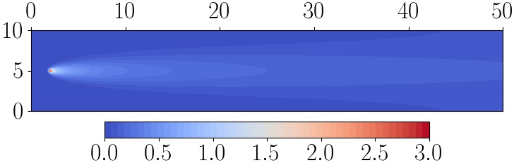
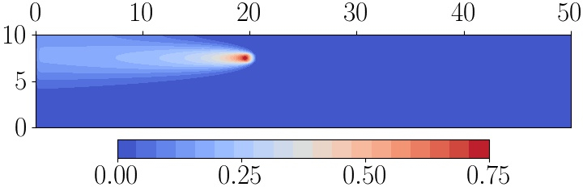
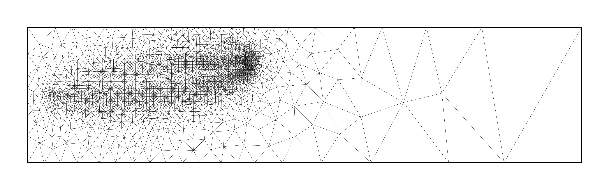
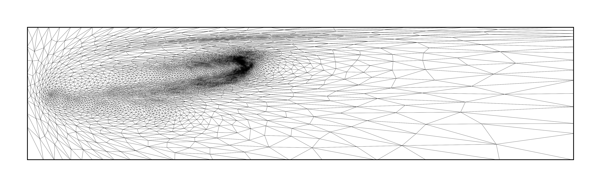
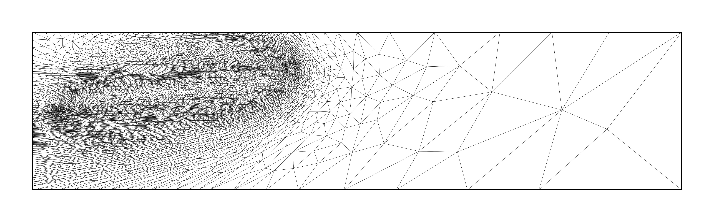
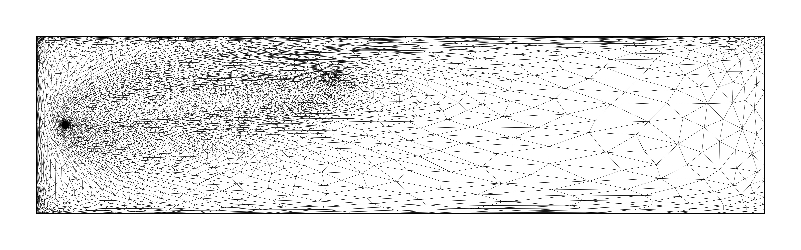

==========
Motivation
==========

Computational physics contains a wide variety of applications
for which the accurate evaluation of a diagnostic
`quantity of interest (QoI)` is more important than the solution
of the prognostic equation that it is associated with. It is such
problems that Pyroteus is designed to solve.

Given a partial differential equation (PDE) and a QoI, we are able
to formulate and solve the associated `adjoint problem`, which
describes how sensitivities of the QoI with respect to the PDE
solution propagate in space and time. Adjoint methods have many
uses, such as sensitivity analysis, gradient-based optimisation
and uncertainity quantification. Another less commonly used use
is for goal-oriented error estimation.

The idea of goal-oriented error estimation is to approximate the
error accrued when evaluating the QoI using a particular
discretisation method in terms of residuals of the PDE and solutions
of the PDE and its adjoint. That is, we approximate an unknown
error quantity -- that we would like to minimise -- in terms of
computable (or at least approximable) quantities. Building upon
this, goal-oriented mesh adaptation takes such error estimators,
deduces local contributions from different regions of time and space
and modifies the discretisation appropriately so that high resolution
is used where the contribution to the QoI error is deemed to be high.
Moreover, low resolution is used where the corresponding contribution
is deemed to be low, meaning that resolution is not wasted
unnecessarily.

Before progressing to the details of goal-oriented error estimation
and mesh adaptation, we provide an example application to demonstrate
a use-case where this technology is useful.

Tracer transport
----------------

Consider a relatively simple, steady-state PDE. Suppose we are
interested in the advection and diffusion of a tracer concentration,
which is being released from a point source. The tracer could represent
a chemical species or pollutant suspended in water, for example.

Let :math:`c(\mathbf x)` denote the tracer concentration at point
:math:`\mathbf x\in\Omega`. The advection and diffusion processes are
governed by the PDE

.. math::
    :label: tracer_eq

    \mathbf u\cdot\nabla c
    -\nabla\cdot(D\nabla c)
    =S,

where :math:`\mathbf u` is the advective velocity, :math:`D` is the
diffusion coefficient and :math:`S` represents the source term.
Consider the "point discharge with diffusion" test case from :cite:`RCJ:14`.
That is, we have a rectangular domain, within which the fluid velocity
goes uniformly from left to right, i.e. :math:`\mathbf u=(1,0)`.
In such a case, we have an inflow across the left-hand boundary and
outflow across the right-hand boundary. Specifying the tracer
concentration to be zero on the inflow inflow, to satisfy natural
boundary conditions on the outflow and to satisfy Neumann conditions on the
channel sides, we are able to formulate and solve the problem numerically.

   Finite element solution of the tracer transport problem.
   Image taken from :cite:`WBHP:22` with authors' permission.

In the above plot, the source term is centred at :math:`(2,5)`.
Tracer concentration is released, advected to the right and diffused
uniformly in all directions. Suppose now that there is also a receiver
region, centred at :math:`(20,7.5)` and with a radius of :math:`0.5`.
This setup can be understood as an idealised version of a
desalination plant outfall scenario, where the tracer is salinity
and we would like to understand the salt content at the inlet pipe
for the plant. In such a setup, the point source is the plant's
outlet pipe and the receiver region is the plant's inlet. As such,
we would like to accurately measure the functional

.. math::
    :label: tracer_qoi

    J(c)=\int_R c\;\mathrm dx,

where :math:`R` denotes the receiver region. Taking this as QoI,
the solution of the corresponding adjoint problem takes the form
below.

   Finite element solution of the adjoint tracer transport problem.
   Image taken from :cite:`WBHP:22` with authors' permission.

Here the receiver region becomes a `source` for the adjoint problem.
Further, where the flow goes from left to right in the forward
problem, it goes from right to left in the adjoint. The adjoint
solution indicates that the QoI is most sensitive to what is happening
near to the receiver - which makes sense - and fairly sensitive to the
upstream conditions - which also makes sense. The adjoint solution is
near-zero downstream since the QoI is effectively independent of what
happens there in this advection-dominated problem.

The goal-oriented error estimation technology allows us to construct
error indicator fields using the forward and adjoint solution fields
shown above. These combine the sensitivity information contributed by
the adjoint solution with information related to error distribution.
The error indicator then tells us which regions of the domain are
important in terms of accurately evaluating the QoI.

Error indicator fields can be used to drive mesh adaptation, as discussed
above. This can be done in a variety of ways. Some examples for the
point discharge problem are shown below, including one approach that
gives rise to isotropic meshes and three which give rise to anisotropic
meshes.

   Goal-oriented adapted meshes generated using various metric strategies.
   Images taken from :cite:`WBHP:22` with authors' permission.

The adapted meshes take rather different forms, but there are a number of
features that they have in common. For example, each of them deploy most
mesh resolution in bands between the source and receiver. In addition,
they tend to use less mesh resolution downstream (where the adjoint
solution is near zero) than upstream of the receiver region.

The `next section <2-goal-oriented-error-estimation.html>`__ gives a
general overview of goal-oriented error estimation, including the main
ideas and fundamental mathematical results.

References
----------

.. bibliography:: 1-references.bib
