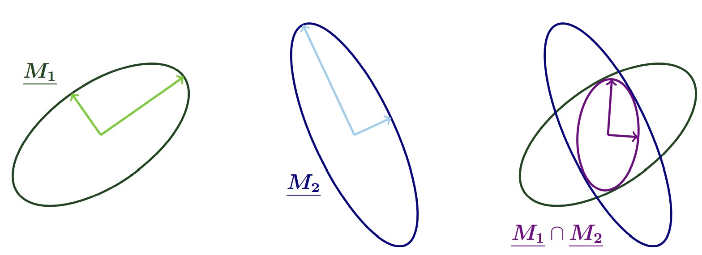

==========================
The metric-based framework
==========================

The goal-oriented mesh adaptation functionality in Pyroteus
is designed such that it is agnostic of the specific method
used to modify the mesh. However, to give a concrete example,
this section describes the *metric-based* mesh adaptation
framework. Integration of this adaptation approach into the
Firedrake finite element library is currently underway.

Metric spaces
-------------

The metric-based framework has its roots in Riemannian
geometry - in particular, Riemannian metric spaces.

A `metric space`
:math:`(\mathcal V,\underline{\mathbf M})` consists
of a vector space :math:`\mathcal V` and a `metric`
:math:`\underline{\mathbf M}` defined upon it. Under
the assumption that :math:`\mathcal V=\mathbb R^n`
for some :math:`n\in\mathbb N`, :math:`\mathcal M` can
be represented as a real :math:`n\times n` symmetric
positive-definite (SPD) matrix. From the metric, we
may deduce a distance function and various geometric
quantities related to the metric space.
The most well-known example of an :math:`n`-dimensional
metric space is Euclidean space, :math:`\mathbb E^n`.
Euclidean space is :math:`\mathbb R^n`, with the
:math:`n`-dimensional identity matrix
:math:`\underline{\mathbf I}` as its metric.
This gives rise to the well-known :math:`\ell_2`
distance function,

.. math::
    :label: l2_distance

    d_2(\mathbf u,\mathbf v)
    :=\sqrt{\sum_{i=1}^n(v_i-u_i)^2}
    =\sqrt{(\mathbf{v}-\mathbf{u})^T\:\underline{\mathbf I}\:(\mathbf{v}-\mathbf{u})}
    =\sqrt{\vec{\mathbf{uv}}^T\:\underline{\mathbf M}\:\vec{\mathbf{uv}}},

where :math:`\vec{\mathbf{uv}}`
denotes the vector from
:math:`\mathbf u=(u_1,\dots,u_n)\in\mathbb R^n` to
:math:`\mathbf v=(v_1,\dots,v_n)\in\mathbb R^n`.

The definition above assumes that the metric takes a fixed
value. A `Riemannian metric space`, on the other hand, is
defined point-wise on a domain :math:`\Omega`, such that
its value is an :math:`n\times n` SPD matrix `at each point`
:math:`\mathbf x\in\Omega`. We use the notation
:math:`\mathcal M=\{\underline{\mathbf M}(\mathbf x)\}_{\mathbf x\in\Omega}`
for the Riemannian metric. Throughout this documentation,
the term `metric` should be understood as referring
specifically to a Riemannian metric. The fact that a
Riemannian metric can vary in space means that Riemannian
metric spaces are warped, when viewed in Euclidean space.
For example, think of the space-time continuum in
General Relativity. This is probably the most famous
example of a Riemannian metric space.

.. figure:: https://upload.wikimedia.org/wikipedia/commons/6/63/Spacetime_lattice_analogy.svg
   :figwidth: 80%
   :align: center

   An example of a Riemannian metric space: the
   gravitational field of the Earth (source:
   `Wikipedia <https://commons.wikimedia.org/w/index.php?curid=45121761>`__).

Given a Riemannian metric
:math:`\mathcal M=\{\underline{\mathbf M}(\mathbf x)\}_{\mathbf x\in\Omega}`,
we can define distance in the associated space as above.
However, since space is warped, we need
to integrate along a `curve`, rather than a straight line.
Given that :math:`\boldsymbol\gamma:[0,1]\rightarrow\mathbb R^n`
parametrises the curve from :math:`\mathbf u\in\Omega` to
:math:`\mathbf v\in\Omega`, the distance may be computed
using the parametric integral

.. math::
    :label: metric_distance

    d_{\mathcal M}(\mathbf u,\mathbf v)
    :=\int_0^1\sqrt{\vec{\mathbf{uv}}\:\underline{\mathbf M}(\boldsymbol\gamma(\xi))\:\vec{\mathbf{uv}}}\;\mathrm d\xi.

We define length in the metric space by

.. math::
    :label: metric_length

    \ell_{\mathcal M}(\vec{\mathbf{uv}})
    :=d_{\mathcal M}(\mathbf u,\mathbf v).

As well as distances and lengths, it is also possible to define
volume in Riemannian space. Given a subset
:math:`K\subseteq\Omega`, its volume is given by

.. math::
    :label: metric_volume

    \left|K\right|_{\mathcal M}
    :=\int_K\sqrt{\underline{\mathbf M}(\mathbf x)}\;\mathrm dx.

The concept of angle also carries over, amongst other things.

Metric fields should be defined in Firedrake using
:class:`firedrake.function.Function`\s from instances of a Lagrange
:func:`firedrake.functionspace.TensorFunctionSpace` of degree 1,
i.e. a tensor space that is piecewise linear and continuous. The
following example code snippet defines a uniform metric and checks
that it is SPD:

.. code-block:: python

   from firedrake import *
   from pyroteus import *

   mesh = UnitSquareMesh(10, 10)
   P1_ten = TensorFunctionSpace(mesh, "CG", 1)
   metric = Function(P1_ten)
   metric.interpolate(as_matrix([[1, 0], [0, 1]))
   check_spd(metric)

Geometric interpretation
------------------------

A convenient way of visualising a Riemannian metric field
is using an ellipse (in 2D) or an ellipsoid (in 3D). As
mentioned above, the metric takes the form of an SPD matrix
:math:`\underline{\mathbf M}(\mathbf x)` at each point in
space, :math:`\mathbf x\in\Omega`. Since it is symmetric,
this matrix has an orthogonal eigendecomposition,

.. math::
    :label: orthogonal_eigendecomposition

    \underline{\mathbf M}(\mathbf x)
    =\underline{\mathbf V}(\mathbf x)\:
    \underline{\boldsymbol\Lambda}(\mathbf x)\:
    \underline{\mathbf V}(\mathbf x)^T,

where
:math:`\underline{\mathbf V}(\mathbf x)=\begin{bmatrix}\mathbf v_1,\dots,\mathbf v_n\end{bmatrix}`
is its matrix of (orthonormal) eigenvectors and
:math:`\underline{\boldsymbol\Lambda}(\mathbf x)=\mathrm{diag}(\lambda_1,\dots,\lambda_n)`
is its matrix of eigenvalues.

Viewed in Euclidean space (i.e. the `physical space`),
a 2D metric can be represented by an ellipse with
:math:`i^{th}` semi-axis taking the direction
:math:`\mathbf e_i:=\mathbf v_i` and having magnitude
:math:`h_i:=1/\sqrt{\lambda_i}`. Viewed in the metric
space (i.e. the `control space`), however, it is
represented by a unit circle.

.. figure:: images/ellipse.jpg
   :figwidth: 80%
   :align: center

   Representation of a 2D Riemannian metric as an ellipse.
   Image taken from :cite:`Wallwork:21` with author's permission.

Given a metric field, the eigendecomposition may be
computed in Pyroteus using the function
:func:`~.compute_eigendecomposition`. Similarly, given
:class:`firedrake.function.Function`\s representing the eigenvectors and
eigenvalues of a metric, it may be assembled using the
function :func:`~.assemble_eigendecomposition`.

The orthogonal eigendecomposition gives rise to another
matrix decomposition, which is useful for understanding
metric-based mesh adaptation. If we define `metric density`
as the square root of the sum of the eigenvalues,

.. math::
    :label: metric_density

    \rho:=\sqrt{\prod_{i=1}^n\lambda_i},

and the :math:`i^{th}` anisotropy quotient in terms of
the metric magnitudes by

.. math::
    :label: anisotropy_quotient

    r_i:=h_i^n\prod_{j=1}^n\frac1{h_j},\quad i=1,\dots,n,

then we arrive at the decomposition

.. math::
    :label: alternative_decomposition

    \underline{\mathbf M}
    =\rho^{\frac2n}\:
    \underline{\mathbf V}\:
    \mathrm{diag}\left(r_1^{-\frac2n},\dots,r_n^{-\frac2n}\right)\:
    \underline{\mathbf V}^T.

The reason that this formulation is useful is because
it separates out information contained within the metric
in terms of:

- sizes (the metric density);
- orientation (the eigenvectors);
- shape (the anisotropy quotients).

These are the three aspects of a mesh that metric-based
mesh adaptation is able to control, whereas other mesh
adaptation methods can only usually control element sizes.

The metric decomposition above can be computed in Pyroteus
using the function :func:`~.density_and_quotients`.

Continuous mesh analogy
-----------------------

The work of :cite:`LA:11` established duality between
the (inherently discrete) mesh and a (continuous)
Riemannian metric field. Having a continuous
representation for the mesh means that we are able to
apply optimisation techniques that are designed for
continuous problems.

An example of one of the correspondences is between
`metric complexity` and mesh vertex count. Metric
complexity is expressed using the formula

.. math::
    :label: metric_complexity

    \mathcal C(\mathcal M)=\int_\Omega\sqrt{\mathrm{det}(\mathcal M(\mathbf x)})\;\mathrm dx.

and can be interpreted as the volume of the spatial
domain in metric space (recall the formula for
volume in Riemannian space). Metric complexity may
be computed in Pyroteus using the function
:func:`~.metric_complexity`.
The time-dependent extension of metric complexity,

.. math::
    :label: space_time_complexity

    \mathcal C(\mathcal M)=\int_{\mathcal T}\int_\Omega\sqrt{\mathrm{det}(\mathcal M(\mathbf x,t)})\;\mathrm dx\;\mathrm dt

over a time interval :math:`\mathcal T` is analogous
to the total number of mesh vertices over all timesteps.

Metric-based mesh adaptation
----------------------------

The idea of metric-based mesh adaptation is to use
a Riemannian metric space `within` the mesher. In
doing so, we seek to modify the mesh so that in
the metric space it is a so-called `unit mesh`.
That is, all of its elements have unit edge length.
For a 2D triangular mesh this means having a mesh
comprised of equilateral elements with all sides
being of length one.
Making the elements consistent in metric space can
be thought of in terms of equidistributing errors,
which is one of the key ideas behind mesh adaptation
in general.

In practice, it is not possible to tessellate space
with regular elements. Therefore, we instead seek a
`quasi-unit mesh`, whose elements are all "close to"
unit, in some sense.

During the mesh adaptation process, the entities,
nodal positions and/or connectivity are modified
in order to move towards a quasi-unit mesh. The way
that this is quantified in practice is using a
`quality function`. For example, consider the 2D
quality function

.. math::
    :label: metric_quality

    Q_{\mathcal M}
    =\frac{\sqrt3}{12}\frac{\sum_{\boldsymbol\gamma\in\partial K}\ell_{\mathcal M}(\boldsymbol\gamma)^2}{|
    K|_{\mathcal M}},

where :math:`\boldsymbol\gamma\in\partial K` indicates
an edge from the edge set of element :math:`K`. It
can be shown that :math:`Q_{\mathcal M}` is minimised
for an equilateral triangular element.

Operations on metrics
---------------------

In order to use metrics to drive mesh adaptation
algorithms for solving real problems, they must
first be made relevant to the application. Metrics
should be normalised in order to account for domain
geometry, dimensional scales and other properties
of the problem, such as the extent to which it is
multi-scale.

In Pyroteus, normalisation is performed by the
function :func:`~.space_normalise` in the
:math:`L^p` sense:

.. math::
    :label: lp_metric

    \mathcal M_{L^p}:=
    \mathcal C_T^{\frac2n}
    \:\left(\int_{\Omega}\mathrm{det}(\underline{\mathbf M})^{\frac p{2p+n}}\;\mathrm dx\right)^{-\frac2n}
    \:\mathrm{det}(\mathcal M)^{-\frac1{2p+n}}
    \:\mathcal M,

where :math:`\mathcal C_T` is the target metric
complexity (i.e. tolerated vertex count),
:math:`n` is the spatial dimension and
:math:`p\in[1,\infty)` is the order of the
normalisation. Taking :math:`p=1` implies a truly
multi-scale metric and this becomes less so for
higher orders. In the limit :math:`p\rightarrow\infty`
we obtain

.. math::
    :label: linf_metric

    \mathcal M_{L^\infty}:=
    \left(\frac{\mathcal C_T}{\mathcal C(\mathcal M)}\right)^{\frac2n}
    \:\mathcal M.

For time-dependent problems, the normalisation
formulation also includes integrals in time. Suppose
:math:`\mathcal T` is the time period of interest,
:math:`\Delta t>0` is the timestep and
:math:`\mathcal C_T` is now the target `space-time`
complexity. Then the function :func:`~.space_time_normalise`
computes

.. math::
    :label: space_time_lp_metric

    \mathcal M_{L^p}:=
    \mathcal C_T^{\frac2n}
    \:\left(\int_{\mathcal T}\frac1{\Delta t}\int_\Omega\mathrm{det}(\underline{\mathbf M})^{\frac p{2p+n}}\;\mathrm dx\;\mathrm dt\right)^{-\frac2n}
    \:\mathrm{det}(\mathcal M)^{-\frac1{2p+n}}
    \:\mathcal M.

In many cases, it is convenient to be able to combine
different metrics. For example, if we seek to adapt
the mesh such that the value of two different error
estimators are reduced. The simplest metric combination
method from an algebraic perspective is the metric
average:

.. math::
    :label: metric_average

    \tfrac12(\mathcal M_1 + \mathcal M_2),

for two metrics :math:`\mathcal M_1` and
:math:`\mathcal M_2`. Whilst mathematically simple,
the geometric interpretation of taking the metric
average is not immediately obvious. Metric intersection,
on the other hand, is geometrically straight-forward,
but non-trivial to write mathematically. The elliptic
interpretation of two metrics is the largest ellipse
which fits within the ellipses associtated with the
two input metrics. As such, metric intersection yields
a new metric whose complexity is greater than (or equal
to) its parents'. This is not true for the metric
average in general. See :cite:`PUDG:01` for details.

   Intersection of two 2D Riemannian metrics, interpreted
   in terms of their elliptical representations.
   Image taken from :cite:`Wallwork:21` with author's permission.

Metric combination may be achieved in Pyroteus using the
functions :func:`~.metric_average`,
:func:`~.metric_intersection`, :func:`~.metric_relaxation`
(generalised average) and simply :func:`~.combine_metrics`,
which defaults to the metric average.

Now that a concrete example of a mesh adaptation approach has
been described, we move on to discuss goal-oriented mesh
adaptation using Pyroteus in the `following section
<4-goal-oriented-mesh-adaptation.html>`__.

References
----------

.. bibliography:: 3-references.bib
